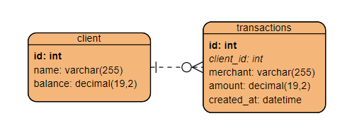

# _transactions_ - Service de gestão de transações

## Recursos
- Validações funcionais em cima da transação
    - Conta inativa
    - Limite de conta excedido
    - Transação superior % do limite
    - Transação duplicada
    - Transação com alta frequência
- Efetivação da transação
- Listar status de uma Conta
- Consulta de localização baseada no CEP

## Mapa de entidades (DB)

###Client (client)
| Campo                  | Tipo           | Descrição                  |
|------------------------|----------------|----------------------------|
| id                     | bigint(20)     | Chave primária (auto)      |
| name                   | varchar(255)   | Nome do cliente            |
| balance                | decimal(19,2)  | Limite da conta do cliente |

###Transação (transaction)
| Campo                  | Tipo           | Descrição                  |
|------------------------|----------------|----------------------------|
| id                     | bigint(20)     | Chave primária (auto)      |
| merchant               | varchar(255)   | Nome do estabelecimento    |
| amount                 | decimal(19,2)  | Limite da conta do cliente |
| created_at             | datetime       | Horário da transação       |
| client_id              | bigint(20)     | FK de Client               |

